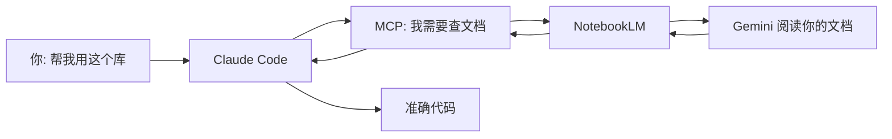

<div align="center">

# Sumulige NotebookLM MCP 服务器

**让您的 AI 代理直接与 NotebookLM 对话，获得基于您文档的准确答案**

[](https://www.typescriptlang.org/)
[](https://modelcontextprotocol.io/)
[](https://www.npmjs.com/package/sumulige-notebooklm-mcp)
[](https://github.com/sumulige/sumulige-notebooklm-mcp)
[](https://github.com/sumulige/sumulige-notebooklm-mcp)

</div>

---

## 第一部分：这是什么？为什么要用它？

### 一个常见的问题

你有没有遇到过这种情况：

> 你让 Claude 帮你写代码，使用某个库的 API。结果它自信地写了一段代码，但运行时却报错——**这个 API 根本不存在**。

这不是 Claude 故意捣乱。问题是：

1. **Claude 的知识有截止日期**——新出的库、更新的 API，它可能不知道
2. **Claude 会"填补空白"**——当信息不足时，它会根据经验"猜测"一个看似合理的答案
3. **读取本地文档消耗巨大**——让 AI 搜索多个文件需要消耗大量 token

### 解决方案

**NotebookLM** 是 Google 基于 Gemini 2.0 构建的"零幻觉"知识库：

- 你上传文档（PDF、网页、YouTube 视频等）
- NotebookLM 阅读并理解这些内容
- 当你提问时，它**只**基于你上传的文档回答——不知道的会直接说不知道

**NotebookLM MCP** 是一座桥梁，让您的 AI 代理（Claude Code、Cursor 等）能够直接向 NotebookLM 提问。

---

## 第二部分：它是如何工作的？

### 一个类比

想象一下：

```
传统方式：
你 → 把文档发给 Claude → Claude 尝试记住 → 可能编造 API

使用 NotebookLM MCP：
你 → Claude 向"图书管理员"提问 → "图书管理员"查阅文档 → 返回准确答案
```

**NotebookLM 就是那个读透了所有文档的"图书管理员"**，而且它拒绝瞎猜。

### 工作流程



### 核心优势

| 特性 | 传统方式 | NotebookLM MCP |
|------|----------|----------------|
| **幻觉风险** | 高 - 可能编造 API | **零** - 只回答文档中的内容 |
| **Token 消耗** | 高 - 需要反复读取文件 | **低** - 只传输问答结果 |
| **知识新鲜度** | 受限于训练截止 | **永远最新** - 你上传的就是最新的 |
| **多文档关联** | 困难 | **简单** - 自动综合多个来源 |

---

## 第三部分：5 分钟快速上手

<details>
<summary><b>前提条件</b>（点击查看）</summary>

- Node.js 18+ 已安装
- Claude Code / Cursor / Codex 任一工具
- Google 账户（用于使用 NotebookLM）

</details>

### 步骤 1：安装（一行命令）

**Claude Code:**
```bash
claude mcp add notebooklm npx sumulige-notebooklm-mcp@latest
```

**Cursor:** 编辑 `~/.cursor/mcp.json`，添加：
```json
{
  "mcpServers": {
    "notebooklm": {
      "command": "npx",
      "args": ["-y", "sumulige-notebooklm-mcp@latest"]
    }
  }
}
```

### 步骤 2：登录 NotebookLM（一次性）

对您的 AI 说：
```
"Log me in to NotebookLM"
```

Chrome 会自动打开，使用 Google 登录即可。

### 步骤 3：创建知识库

1. 访问 [notebooklm.google.com](https://notebooklm.google.com)
2. 创建笔记本，上传您的文档
3. 点击 ⚙️ Share → Anyone with link → 复制链接

### 步骤 4：开始使用

告诉您的 AI：
```
"I'm working with [库名]。这是我的 NotebookLM：[粘贴链接]"
```

**就这样！** 现在当您提问时，AI 会自动向 NotebookLM 查询文档中的准确信息。

---

## 第四部分：核心概念详解

<details>
<summary><b>什么是"零幻觉"？</b></summary>

NotebookLM 的设计原则是：**严格基于提供的来源回答**。

- 如果文档中有答案 → 准确引用并回答
- 如果文档中没有答案 → 直接说"文档中没有提到这个信息"

这与通用大语言模型不同——通用模型倾向于" helpful"，即使不知道也会尝试推测一个答案。

</details>

<details>
<summary><b>为什么需要 MCP？</b></summary>

**MCP（Model Context Protocol）** 是 AI 代理使用外部工具的标准方式。

可以把它理解为 AI 的"USB 接口"：
- AI 本身不能直接访问互联网
- 但通过 MCP，AI 可以调用各种"工具"（如浏览器、数据库）
- NotebookLM MCP 就是这样一个工具，让 AI 能够查询 NotebookLM

</details>

<details>
<summary><b>自动追问是什么？</b></summary>

这是最强大的功能之一。当您问一个复杂问题时，AI 会：

1. 先问 NotebookLM 一个基础问题
2. 根据答案，提出更深入的追问
3. 重复这个过程，直到完全理解

**示例：**
```
你: "怎么用这个状态管理库？"

AI → NotebookLM: "这个库的核心概念是什么？"
    → 得到答案后 →
    → NotebookLM: "怎么初始化 store？"
    → 得到答案后 →
    → NotebookLM: "如何处理异步 action？"

最终: AI 综合所有答案，写出准确的代码
```

</details>

---

## 第五部分：安装指南

### 系统要求

| 要求 | 最低 | 推荐 |
|------|------|------|
| Node.js | 18.0.0 | 20.x LTS |
| 内存 | 2 GB | 4 GB |
| 磁盘空间 | 500 MB | 1 GB |

### 按客户端安装

<details>
<summary><b>Claude Code</b></summary>

```bash
# 安装
claude mcp add notebooklm npx sumulige-notebooklm-mcp@latest

# 验证
claude mcp list

# 卸载
claude mcp remove notebooklm
```

</details>

<details>
<summary><b>Cursor</b></summary>

编辑 `~/.cursor/mcp.json`：

```json
{
  "mcpServers": {
    "notebooklm": {
      "command": "npx",
      "args": ["-y", "sumulige-notebooklm-mcp@latest"]
    }
  }
}
```

**注意：** 修改后需要重启 Cursor。

</details>

<details>
<summary><b>Codex</b></summary>

```bash
# 安装
codex mcp add notebooklm -- npx sumulige-notebooklm-mcp@latest

# 验证
codex mcp list

# 卸载
codex mcp remove notebooklm
```

</details>

<details>
<summary><b>Gemini / VS Code / 其他</b></summary>

**Gemini:**
```bash
gemini mcp add notebooklm npx sumulige-notebooklm-mcp@latest
```

**VS Code:**
```bash
code --add-mcp '{"name":"notebooklm","command":"npx","args":["sumulige-notebooklm-mcp@latest"]}'
```

**通用配置格式:**
```json
{
  "mcpServers": {
    "notebooklm": {
      "command": "npx",
      "args": ["sumulige-notebooklm-mcp@latest"]
    }
  }
}
```

</details>

---

## 第六部分：使用场景和示例

### 场景 1：学习新框架

**问题：** 你想用一个新的 UI 框架，但不知道 API

**操作：**
```
"我要用 [框架名] 构建应用。这是文档 NotebookLM：[链接]"
"这个框架的组件系统是怎么工作的？"
"给我一个完整的组件示例"
```

**结果：** AI 基于文档给你准确的代码，不会编造不存在的 API。

---

### 场景 2：查询内部 API 文档

**问题：** 公司的内部 API 文档很复杂

**操作：**
1. 把内部文档上传到 NotebookLM
2. 告诉 AI 链接
3. 提问："我们的用户认证流程是怎样的？"

**结果：** AI 准确引用内部文档，给出正确的 API 调用方式。

---

### 场景 3：综合多源信息

**问题：** 信息分散在多个文档、视频、网页中

**操作：**
- 在 NotebookLM 中创建笔记本
- 添加多个来源（PDF、网站、YouTube 视频等）
- 让 AI 综合回答

**结果：** NotebookLM 关联所有来源，给出综合性答案。

---

### 常用指令速查

| 意图 | 对 AI 说 | 结果 |
|------|----------|------|
| 认证 | "Log me in to NotebookLM" | 打开登录窗口 |
| 添加笔记本 | "Add [link] to library" | 保存笔记本 |
| 列出笔记本 | "Show our notebooks" | 显示所有保存的笔记本 |
| 选择笔记本 | "Use the React notebook" | 设置活动笔记本 |
| 查看浏览器 | "Show me the browser" | 实时查看 NotebookLM 对话 |
| 修复认证 | "Repair NotebookLM authentication" | 清除并重新认证 |

---

## 第七部分：高级配置

<details>
<summary><b>工具配置文件（减少 Token 消耗）</b></summary>

通过只加载需要的工具来减少 Token 使用：

| 配置 | 工具数 | 包含工具 |
|------|--------|----------|
| **minimal** | 5 | 仅查询：`ask_question`, `get_health`, `list_notebooks`, `select_notebook`, `get_notebook` |
| **standard** | 10 | + 库管理：`setup_auth`, `list_sessions`, `add_notebook`, `update_notebook`, `search_notebooks` |
| **full** | 16 | 所有工具 |

**配置方式：**
```bash
# 环境变量
export NOTEBOOKLM_PROFILE=minimal

# CLI
npx sumulige-notebooklm-mcp@latest --profile minimal
```

</details>

<details>
<summary><b>环境变量配置</b></summary>

**浏览器行为：**
```bash
export HEADLESS=false          # 显示浏览器窗口
export BROWSER_TIMEOUT=60000   # 超时时间（毫秒）
```

**隐身模式（模拟人类行为）：**
```bash
export STEALTH_ENABLED=true
export STEALTH_HUMAN_TYPING=true
export TYPING_WPM_MIN=160      # 打字速度范围
export TYPING_WPM_MAX=240
```

**会话管理：**
```bash
export MAX_SESSIONS=10         # 最大并发会话
export SESSION_TIMEOUT=900     # 会话超时（秒）
```

完整配置说明见：[docs/configuration.md](./docs/configuration.md)

</details>

<details>
<summary><b>故障排查</b></summary>

**"Chrome not found"**
- Linux: `sudo apt install chromium-browser`
- macOS/Windows: Chrome 会自动安装

**"ProcessSingleton error"**
- 关闭所有 Chrome 窗口后重试
- 或设置 `NOTEBOOK_PROFILE_STRATEGY=isolated`

**"Session expired"**
- 运行："Re-authenticate with NotebookLM"

更多问题解决方案：[docs/troubleshooting.md](./docs/troubleshooting.md)

</details>

<details>
<summary><b>新架构特性开关</b></summary>

v1.2.1 引入了六边形架构重构，通过特性开关可启用新组件：

| 环境变量 | 描述 | 默认 |
|----------|------|------|
| `FF_USE_NEW_ARCHITECTURE` | 启用所有新架构组件 | `false` |
| `FF_USE_EVENT_BUS` | 事件总线（松耦合） | `false` |
| `FF_USE_AUTH_STATE_MACHINE` | 认证状态机 | `false` |
| `FF_USE_SESSION_ACTOR` | Actor 模型（顺序消息处理） | `false` |
| `FF_USE_RESPONSE_OBSERVER` | MutationObserver（替代轮询） | `false` |

**启用全部新特性：**
```bash
FF_USE_NEW_ARCHITECTURE=true npx sumulige-notebooklm-mcp@latest
```

**逐个启用：**
```bash
FF_USE_SESSION_ACTOR=true FF_USE_RESPONSE_OBSERVER=true npx sumulige-notebooklm-mcp@latest
```

</details>

---

## 第八部分：HTTP API（可选）

除了 MCP 协议，NotebookLM MCP 还提供 **REST API** 接口，可用于：

- Web 应用集成
- 自定义客户端开发
- 微服务架构
- 自动化脚本

### 启动 HTTP 服务器

```typescript
import { ToolHandlers } from "sumulige-notebooklm-mcp";
import { createHttpAdapter } from "sumulige-notebooklm-mcp/adapters";

const adapter = createHttpAdapter(toolHandlers, {
  port: 3000,
  prefix: "/api/v1",
  cors: { origin: true }
});

await adapter.start();
// 服务器运行在 http://localhost:3000
```

### API 端点一览

| 方法 | 端点 | 描述 |
|------|------|------|
| `GET` | `/health` | 健康检查 |
| `POST` | `/api/v1/ask` | 向 NotebookLM 提问 |
| `GET` | `/api/v1/sessions` | 列出所有会话 |
| `DELETE` | `/api/v1/sessions/:id` | 关闭会话 |
| `POST` | `/api/v1/sessions/:id/reset` | 重置会话 |
| `GET` | `/api/v1/notebooks` | 列出笔记本库 |
| `POST` | `/api/v1/notebooks` | 添加笔记本 |
| `GET` | `/api/v1/notebooks/:id` | 获取笔记本详情 |
| `PUT` | `/api/v1/notebooks/:id` | 更新笔记本 |
| `DELETE` | `/api/v1/notebooks/:id` | 删除笔记本 |
| `POST` | `/api/v1/notebooks/:id/select` | 设为活动笔记本 |
| `GET` | `/api/v1/library/stats` | 获取库统计 |
| `POST` | `/api/v1/auth/setup` | 设置认证 |
| `POST` | `/api/v1/auth/reauth` | 重新认证 |
| `POST` | `/api/v1/cleanup` | 清理数据 |

### 使用示例

**提问：**
```bash
curl -X POST http://localhost:3000/api/v1/ask \
  -H "Content-Type: application/json" \
  -d '{"question": "这个库怎么初始化？"}'
```

**流式进度（SSE）：**
```bash
curl -X POST http://localhost:3000/api/v1/ask \
  -H "Content-Type: application/json" \
  -H "Accept: text/event-stream" \
  -d '{"question": "详细解释认证流程"}'
```

**列出笔记本：**
```bash
curl http://localhost:3000/api/v1/notebooks
```

### 配置选项

```typescript
interface HttpAdapterConfig {
  port: number;           // 监听端口
  host?: string;          // 主机地址，默认 "0.0.0.0"
  prefix?: string;        // API 前缀，默认 "/api/v1"
  cors?: {
    origin?: string | string[] | boolean;  // CORS 来源
    credentials?: boolean;                  // 允许凭据
  };
}
```

### 流式响应（Streaming）

v1.2.2 新增流式响应功能，实现类似 ChatGPT 的逐字输出体验。

**特性：**
- 🌊 **逐字输出** - 响应文本实时流式返回
- 🔒 **安全措施** - 内置间隔和随机抖动，模拟人类行为
- ⚙️ **可配置** - 支持自定义块大小、间隔时间

**使用方式：**

```typescript
// 通过 handleAskQuestion 启用流式
const result = await handlers.handleAskQuestion({
  question: "这个库怎么使用？",
  streaming: true,
  streaming_options: {
    min_interval_ms: 100,  // 最小发送间隔
    max_jitter_ms: 50,     // 随机抖动范围
    chunk_size: 0          // 0 = 逐字，>0 = 按块
  }
}, sendProgress, (chunk, fullText) => {
  // 每收到新内容时调用
  process.stdout.write(chunk);
});

// 或直接使用 session
const result = await session.askWithStreaming(
  "解释认证流程",
  (chunk, fullText) => console.log(chunk),
  { minIntervalMs: 100 }
);
```

**流式选项：**

| 选项 | 类型 | 默认值 | 描述 |
|------|------|--------|------|
| `min_interval_ms` | number | 100 | 两次发送之间的最小间隔（毫秒） |
| `max_jitter_ms` | number | 50 | 随机抖动范围（毫秒） |
| `chunk_size` | number | 0 | 块大小（0 = 逐字符，>0 = 按指定字符数） |

**返回结果：**

```typescript
interface StreamingResult {
  success: boolean;
  response?: string;      // 完整响应文本
  error?: string;
  durationMs: number;     // 总耗时
  totalChars?: number;    // 总字符数
  chunkCount?: number;    // 发送的块数
}
```

**安全说明：**
- 内置最小 100ms 间隔防止请求过于频繁
- 随机抖动模拟人类行为，降低被检测风险
- 逐字模式下每字符 10-30ms 随机延迟

---

## 第九部分：更多文档

| 文档 | 描述 | 链接 |
|------|------|------|
| 安装指南 | 详细安装步骤、系统要求、验证方法、卸载和升级 | [docs/installation.md](./docs/installation.md) |
| 使用指南 | 高级用法、工作流、最佳实践、模式 | [docs/usage-guide.md](./docs/usage-guide.md) |
| 工具参考 | 完整 MCP 工具 API 文档、参数说明 | [docs/tools.md](./docs/tools.md) |
| 配置说明 | 环境变量、运行时配置、工具配置 | [docs/configuration.md](./docs/configuration.md) |
| HTTP API | REST API 端点和使用说明 | [README.md#第八部分http-api可选](#第八部分http-api可选) |
| 流式响应 | 逐字输出、配置选项、安全措施 | [README.md#流式响应streaming](#流式响应streaming) |
| 问题排查 | 常见问题和解决方案 | [docs/troubleshooting.md](./docs/troubleshooting.md) |

---

## 常见问题

<details>
<summary><b>真的零幻觉吗？</b></summary>

是的。NotebookLM 专门设计为仅从上传的来源回答。如果不知道，它会直接说不知道。
</details>

<details>
<summary><b>有速率限制吗？</b></summary>

免费 tier 每个账户每天有查询次数限制。支持快速切换账户继续研究。
</details>

<details>
<summary><b>这有多安全？</b></summary>

Chrome 在本地运行。您的凭据永远不会离开您的机器。如果担心，可以使用专用的 Google 账户。
</details>

<details>
<summary><b>可以看到正在发生什么吗？</b></summary>

可以！对 AI 说 "Show me the browser" 来实时观看 NotebookLM 对话。
</details>

---

<div align="center">

Built with frustration about hallucinated APIs, powered by Google's NotebookLM

⭐ [在 GitHub 上 Star](https://github.com/sumulige/sumulige-notebooklm-mcp) 如果这能节省您的调试时间！

[English Version](./README_EN.md) • [报告问题](https://github.com/sumulige/sumulige-notebooklm-mcp/issues)

</div>
